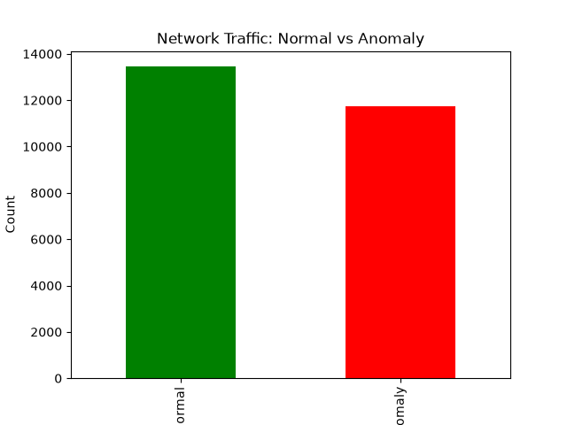
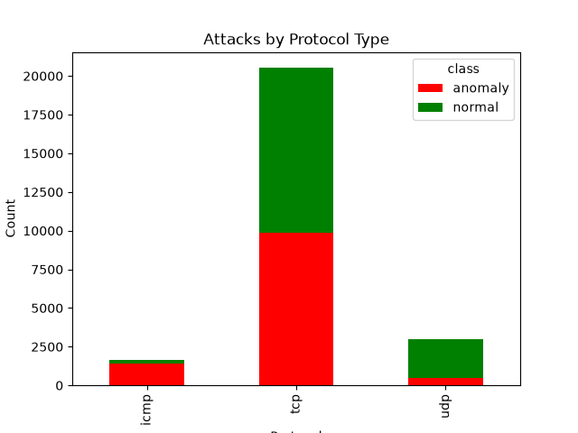
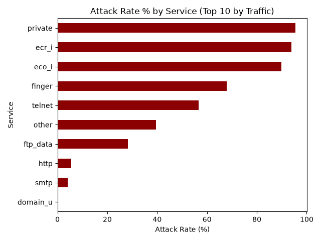

# 🛡️ Network Traffic Analysis


> A data analytics project that uncovers which network protocols and services are most associated with malicious traffic — analyzed using **Python (Pandas)** and validated with **SQL**.

---

## 📊 Overview

This project explores a real-world network intrusion dataset to answer one core question:

> **"Which parts of network traffic are most likely to be an attack — and which are actually safe, despite appearances?"**

---

## 📁 Dataset

| | |
|---|---|
| **Source** | [Network Intrusion Detection — Kaggle](https://www.kaggle.com/datasets/sampadab17/network-intrusion-detection) |
| **Rows** | 25,192 |
| **Columns** | 42 |
| **Missing values** | None ✅ |
| **Target column** | `class` → `normal` / `anomaly` |

---

## 🛠️ Tools & Tech

- **Python** — Pandas for data wrangling
- **Matplotlib** — data visualization
- **SQL (SQLite)** — query-based validation of findings
- **Git & GitHub** — version control

---

## 🔍 Key Findings

### 1️⃣ Overall Traffic Split
The dataset is well-balanced — **53.4% normal**, **46.6% anomaly** — ideal for unbiased analysis.

### 2️⃣ Protocol-Level Risk 🚨
| Protocol | Attack Rate |
|---|---|
| **ICMP** | **84%** 🔴 |
| TCP | 48% 🟠 |
| UDP | 17% 🟢 |

ICMP traffic is disproportionately malicious — consistent with real-world attacks like ping floods and smurf attacks.

### 3️⃣ Service-Level Risk — The Surprising Insight 💡
| Service | Traffic Volume | Attack Rate |
|---|---|---|
| `private` | 4,351 | **95.4%** 🔴 |
| `ecr_i` | 613 | **93.8%** 🔴 |
| `eco_i` | 909 | **89.8%** 🔴 |
| `http` | 8,003 (highest!) | **5.5%** 🟢 |
| `domain_u` | 1,820 | **0.2%** 🟢 |

**The standout finding:** `http` carries the *most* traffic in the dataset, yet is one of the *safest* services. Obscure, low-traffic services like `private` are almost always malicious. **High traffic volume ≠ high risk.**

### 4️⃣ Cross-Validation with SQL ✅
The protocol-wise breakdown was re-run as a raw SQL query (`GROUP BY` on a SQLite database) and produced **identical results** to the Pandas analysis — confirming the findings hold across both tools.

---

## 📈 Visualizations

| Chart | What it shows |
|---|---|
|  | Overall normal vs. anomaly split |
|  | Attack distribution by protocol |
|  | Attack rate % by service (top 10 by traffic) |

---

## ▶️ How to Run

```bash
pip install pandas matplotlib
python explore.py
```

---

## 📂 Project Structure
